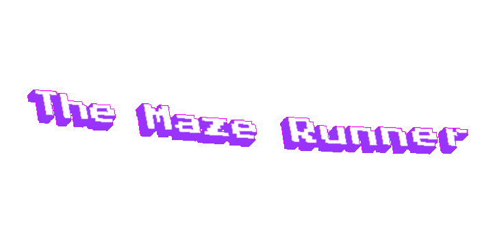

---

# Hello, we are The Maze Runner!
 
We are making a labyrinth game.  
You can see our presentation here:
<a href="Presentation and Documentation/Presentation.pptx" >Presentation</a>

# Table of contents
 
+ [Participants](#participants)
+ [Used technologies](#used-technologies)
+ [Future ideas](#future-ideas)
+ [Installation](#installation)
 

##  Participants 

**Petya Petkova - Scrum Trainer**
- *Email* : [*PIPetkova19@codingburgas.bg*](mailto:PIPetkova19@codingburgas.bg)

**Dimitar Grudov - Back-end Developer**
- *Email* : [*DHGrudov19@codingburgas.bg*](mailto:DHGrudov19@codingburgas.bg)

**Vesela Dekova - Front-end Developer**
- *Email* : [*VBDekova19@codingburgas.bg*](mailto:VBDekova19@codingburgas.bg)

**Kameliya Yaneva - QA**
- *Email* : [*KKYaneva19@codingburgas.bg*](mailto:KKYaneva19@codingburgas.bg)

 

##  Used technologies 

 

 Visual Studio   
 PowerPoint   
 Word  
 Excel  
 GIPHY  
 Teams  
 

##  Future ideas 

 

1. To improve the logo.  
2. To add more levels.  

 

##  Installation

 

 - Open cmd with Windows + "R";  
 - Type the directory where you want to download the repo;  
 - Type git clone + https://github.com/PIPetkova19/The-Maze-Runner;  
 
Or you can download it from the site.